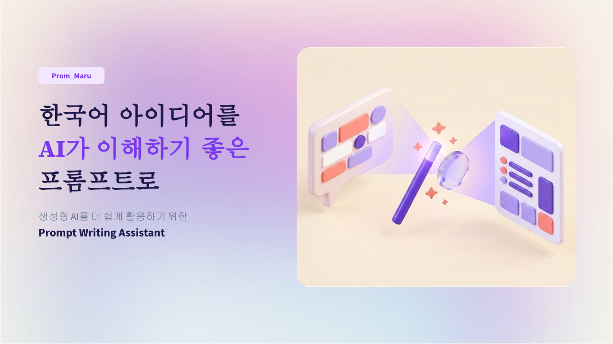
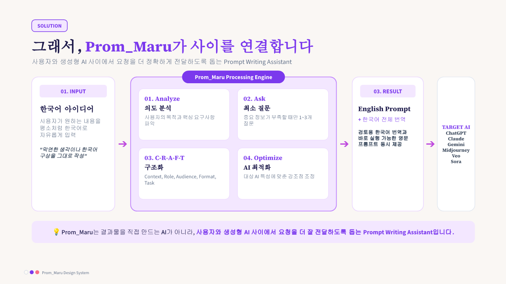
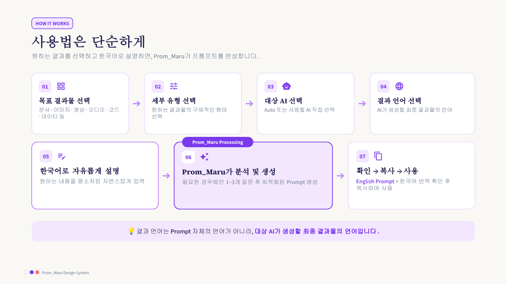
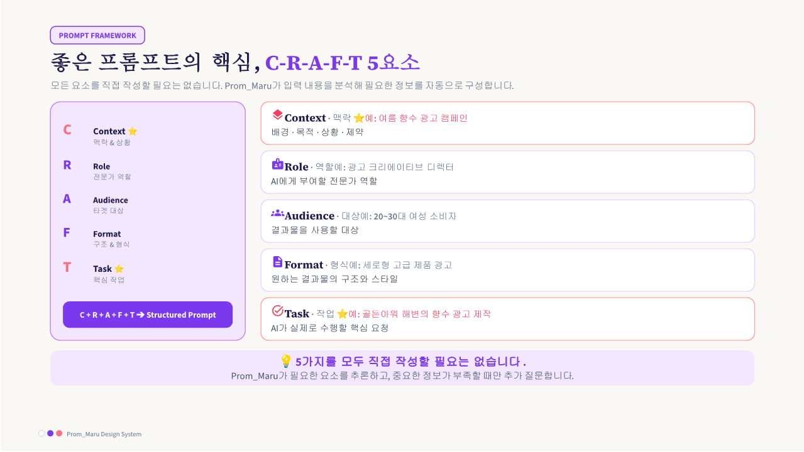
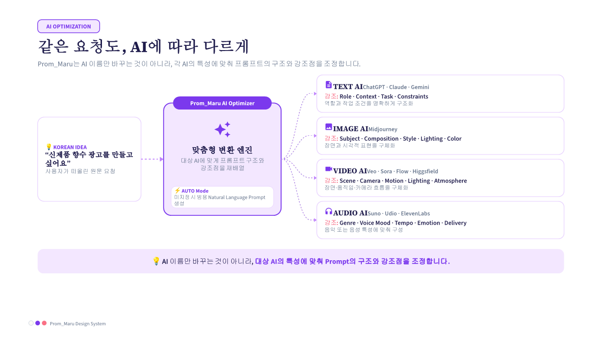
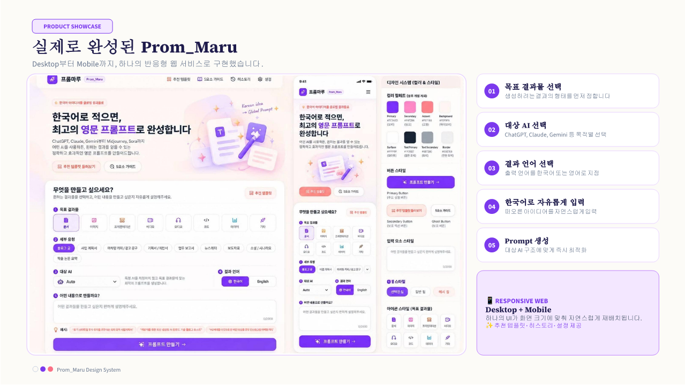
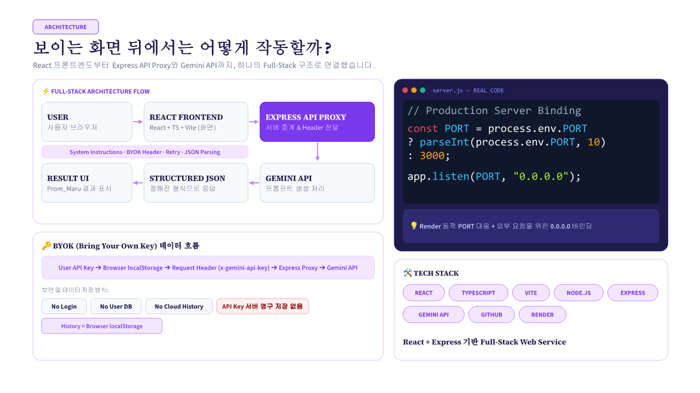
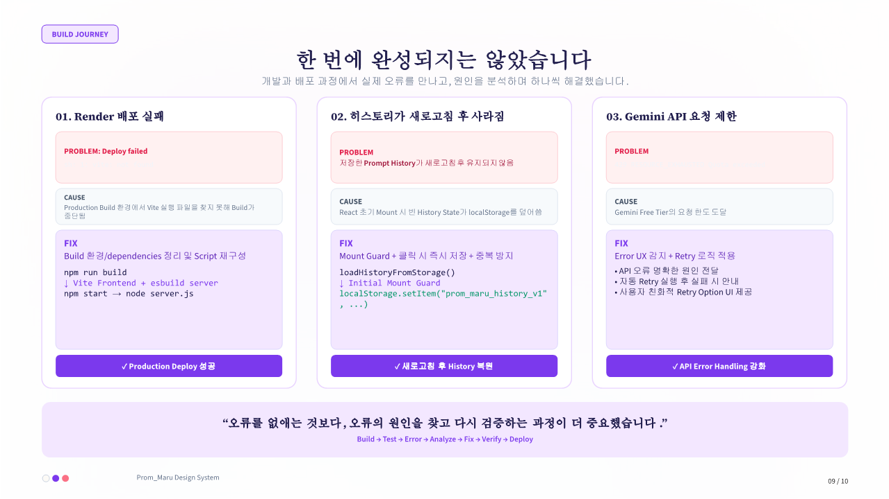
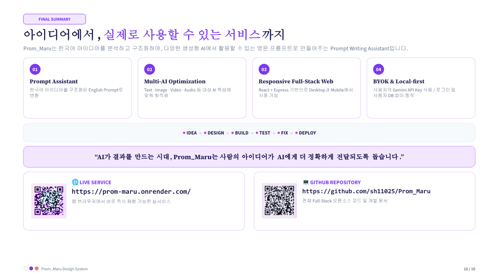
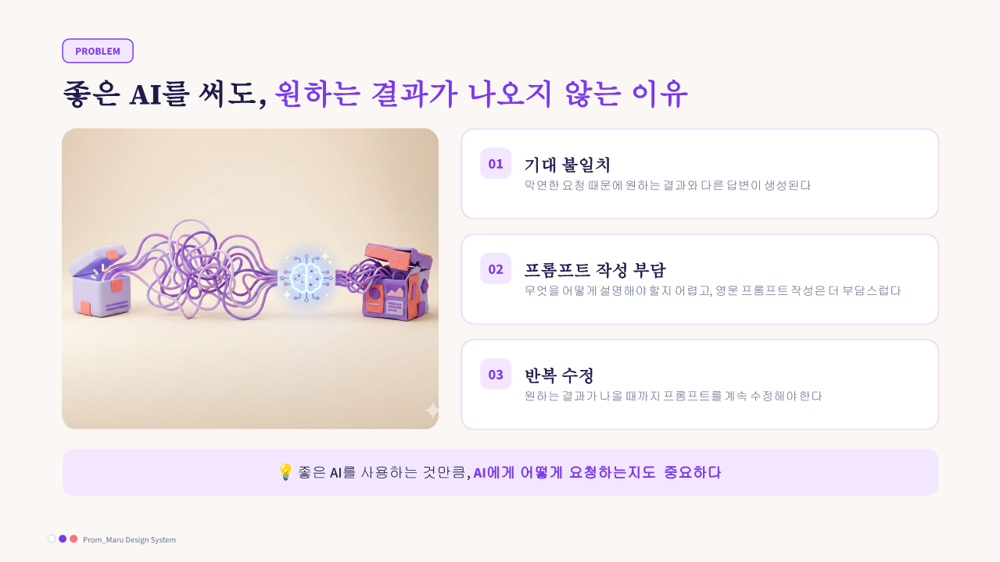

# Prom_Maru (프롬마루)

> **한국어 아이디어를 AI가 이해하기 좋은 영문 프롬프트로 만들어주는 Prompt Writing Assistant**  
> *Transform Korean ideas into high-performance English prompts for generative AI models.*

<div align="center">

[](https://prom-maru.onrender.com/)
[](https://github.com/sh11025/Prom_Maru)

[](https://react.dev/)
[](https://www.typescriptlang.org/)
[](https://vitejs.dev/)
[](https://nodejs.org/)
[](https://expressjs.com/)
[](https://ai.google.dev/)
[](https://render.com/)

</div>

<br>

<div align="center">
  
</div>

---

## 🌟 What is Prom_Maru?

**Prom_Maru(프롬마루)**는 일상적인 한국어로 작성된 아이디어를 글로벌 생성형 AI 모델이 가장 잘 이해할 수 있는 **구조화된 고품질 영문 프롬프트(English Prompt)**로 탈바꿈해주는 **프롬프트 저작 어시스턴트(Prompt Writing Assistant)**입니다.

> ⚠️ **핵심 정의**: Prom_Maru는 이미지나 영상을 직접 렌더링하는 최종 생성 서비스가 아닙니다. **ChatGPT, Claude, Midjourney, Veo, Sora 등 다양한 생성형 AI를 사용할 때 최상의 결과물을 단번에 얻을 수 있도록 프롬프트를 전문적으로 설계해주는 도구**입니다.

* 🌐 **배포 서비스**: [https://prom-maru.onrender.com/](https://prom-maru.onrender.com/)
* 💻 **GitHub 저장소**: [https://github.com/sh11025/Prom_Maru](https://github.com/sh11025/Prom_Maru)

---

## ❓ Why Prom_Maru?

<div align="center">
  
</div>

### "최고 성능의 AI를 써도 원하는 결과가 나오지 않는 이유"
ChatGPT, Midjourney, Veo, Sora 등 글로벌 최신 모델들은 **구체적인 맥락(Context)과 과업(Task)이 영문으로 명확히 정의되었을 때** 가장 높은 성능을 냅니다. 하지만 한국어 사용자가 매번 영어로 복잡한 프롬프트 구조와 세부 지시문을 작성하는 일은 큰 장벽입니다.

### Prom_Maru의 해결책
1. **자유로운 한국어 입력**: 사용자는 편안한 한국어로 무엇을 만들고 싶은지 설명합니다.
2. **지능형 결측 분석 & 최소 질문**: 입력이 구체적이면 즉시 완성 초안(Draft)을 생성하고, 모호한 경우에만 **1~3개의 짧은 선택지형 질문**을 건네어 피로도를 최소화합니다.
3. **영문 프롬프트 우선 + 한국어 1:1 완역**: 대상 AI에 그대로 붙여넣을 수 있는 영문 본문과 함께, 내용 검토를 돕는 **충실한 한국어 번역본**을 동시에 제공합니다.

---

## 🔄 How It Works

<div align="center">
  
</div>

Prom_Maru는 다음의 일관된 7단계 파이프라인으로 동작합니다:

```text
[1. 목표 결과물 선택] ──> [2. 세부 유형 선택] ──> [3. 대상 AI 선택] ──> [4. 결과 언어 지정]
         │
         ▼
[5. 한국어 아이디어 입력] (또는 32개 추천 템플릿 불러오기)
         │
         ▼
[6. Prom_Maru C-R-A-F-T 구조화 & 프록시 최적화 생성]
         │
         ▼
[7. 영문 프롬프트 원클릭 복사 & 대상 AI에 즉시 적용 / 이대로 사용]
```

### 8대 카테고리 지원 현황
* 📄 **문서 / 텍스트**: 블로그 글, 사업계획서, 마케팅 카피, 기획서, 업무 보고서, 뉴스레터
* 🎨 **이미지 / 디자인**: 실사 제품 사진, 미니멀 로고, 디지털 일러스트, 3D 캐릭터 콘셉트, UI 목업
* 📊 **프레젠테이션**: 스타트업 피치덱 (10-12장), 신규 제안 슬라이드, 워크숍 강의자료
* 🎬 **비디오 / 영상**: 쇼츠/릴스 (15~30초), 시네마틱 트레일러, 제품 광고, 3D 모션 영상
* 🎵 **오디오 / 음성**: 내레이션 보이스오버, 팟캐스트 인트로, 시네마틱 BGM, 로파이 칠 비트
* 💻 **코드 / 개발**: React 컴포넌트, Node.js REST API, SQL 성능 최적화, 파이썬 스크립트
* 📈 **데이터 / 분석**: A/B 테스트 분석, KPI 대시보드 지표 설계, 고객 코호트 리텐션 진단
* ✨ **기타 / 커스텀**: 인터뷰 질문지, 브랜드 네이밍/슬로건, 업무 자동화 워크플로

---

## 🧭 C-R-A-F-T Framework

<div align="center">
  
</div>

Prom_Maru는 검증된 프롬프트 엔지니어링 구조인 **C-R-A-F-T** 5대 요소를 핵심 뼈대로 삼습니다.

| 요소 | 설명 | 사용자 입력 원칙 |
|---|---|---|
| **C (Context)** | 배경, 상황, 비즈니스 목적, 선행 조건 및 제약사항 | ⭐ **핵심 입력** (사용자가 직접 설명) |
| **R (Role)** | AI에게 부여할 전문 페르소나 및 판단 기준 | 💡 **자동 추론** (맥락에 맞춰 AI가 자동 설정) |
| **A (Audience)** | 결과물을 소비할 독자, 고객, 청중의 관점과 눈높이 | 💡 **자동 추론** (문맥 기반으로 AI가 도출) |
| **F (Format)** | 산출물 양식, 마크다운 구조, 매체별(해상도/화면비/연출) 규격 | ⚙️ **프리셋/추론** (카테고리/유형 자동 반영) |
| **T (Task)** | 대상 AI가 구체적으로 단계별로 수행해야 할 핵심 작업 명령 | ⭐ **핵심 입력** (사용자가 원하는 것) |

> 📌 **Zero-Burden 원칙**: 사용자가 5개 항목을 억지로 채울 필요가 없습니다. 핵심 아이디어(Context, Task)만 적으면 Role과 Audience는 Prom_Maru가 최적의 상태로 자동 추론합니다.

---

## 🎯 Target AI Optimization

<div align="center">
  
</div>

Prom_Maru는 검증되지 않은 독점 파라미터나 비공개 명령어를 임의로 날조하지 않습니다. **각 모델이 가장 잘 반응하는 자연어 묘사 방식, 정보 구조화 순서, 매체별 강조점**을 정밀하게 분기 최적화합니다.

* **Auto (범용 모드)**: 특정 플랫폼 문법에 얽매이지 않고 표준 자연어로 기술되어 어떤 AI 모델에 넣어도 안정적인 결과 보장.
* **ChatGPT / Claude / Gemini**: 명확한 마크다운 계층, 페르소나 부여, 단계별 추론(Chain-of-thought), 입출력 제약사항 강조.
* **Midjourney**: 피사체의 세부 질감, 조명(Lighting), 렌즈 특성, 색감, 화풍을 서술형 자연어 구문으로 정밀 배치.
* **Google Veo / OpenAI Sora**: 카메라 동역학(Dolly, Pan, Drone tracking), 시공간적 연속성, 물리 법칙 및 시네마틱 무드 서술.
* **Google Flow / Higgsfield / Runway / Kling**: 인물 동작, 씬 전환 에너지, 숏 구성 지침 반영.
* **ElevenLabs / Suno / Udio**: 발화 톤앤매너, 호흡, 음색 묘사 및 음악 장르, BPM, 악기 구성, [Verse]/[Chorus] 구조화.
* **GitHub Copilot**: TypeScript 타입 규격, 함수 시그니처, 엣지 케이스 처리 및 클린 코드 아키텍처 원칙 명시.

### 🌐 '결과 언어' 설정의 의미
* **프롬프트 본문**: 모델 이해도를 위해 항상 **English**로 작성됩니다.
* **한국어 완역본**: 사용자의 쉬운 검토와 수정을 위해 **Korean** 번역본이 1:1로 함께 제공됩니다.
* **결과 언어 (Result Language)**: 최종 프롬프트 내에 `Language Directive`를 삽입하여, 대상 AI가 최종 출력물을 산출할 때 적용할 언어(예: 한국어/English)를 강제합니다.

---

## 📱 Product UI

<div align="center">
  
</div>

* **Warm Ivory & Violet/Coral**: 장시간 사용에도 눈이 편안한 웜 아이보리(`#FAF8F5`) 배경에 프라이머리 바이올렛(`#7C3AED`) 및 소프트 코랄(`#FB7185`) 엑센트.
* **데스크톱 & 모바일 완벽 반응형**: 데스크톱 2컬럼 레이아웃부터 모바일 헤더 드롭다운 및 모바일 카드 뷰포트까지 유연한 반응형 UI.
* **카드형 워크벤치 (Card Workbench)**: 조잡한 알약형 UI를 배제하고 직관적인 카드형 정보 구조로 프롬프트 편집, C-R-A-F-T 5요소 해체 분석, 완성도 리뷰를 한눈에 파악.

---

## 🏗️ Architecture

<div align="center">
  
</div>

Prom_Maru는 프론트엔드와 백엔드가 유기적으로 결합된 **Full-Stack SPA + Express API Proxy** 구조입니다.

```text
┌────────────────────────────────────────────────────────┐
│                   User Browser Client                  │
│  - React 19 + TypeScript + Vite SPA                   │
│  - Tailwind CSS v4 + Pretendard                        │
│  - State Management & Browser localStorage             │
└───────────────────────────┬────────────────────────────┘
                            │ HTTP JSON API Proxy
                            │ (Header: x-gemini-api-key)
┌───────────────────────────▼────────────────────────────┐
│              Node.js Express Server (server.ts)        │
│  - Production Static File Serving (dist/)              │
│  - Gemini API Proxy (/api/prom-maru/generate)          │
│  - Prom_Maru System Instructions Enforcement           │
│  - Robust JSON Response Parsing & Auto-Retry           │
│  - Connection Test (/api/gemini/test-connection)       │
│  - Simulation (/api/prom-maru/simulate)                │
└───────────────────────────┬────────────────────────────┘
                            │ HTTPS (@google/genai SDK)
┌───────────────────────────▼────────────────────────────┐
│                    Google Gemini API                   │
│  - Models: gemini-3.8-flash / gemini-flash-latest      │
└────────────────────────────────────────────────────────┘
```

---

## 🔒 BYOK & Privacy

Prom_Maru는 사용자의 프라이버시를 절대 침해하지 않는 투명한 아키텍처를 고수합니다.

* **BYOK (Bring Your Own Key)**: 각 사용자가 자신의 Google Gemini API Key를 직접 입력하여 독립적으로 사용합니다.
* **회원가입 / 로그인 없음**: 어떠한 개인정보나 계정도 요구하지 않습니다.
* **서버 데이터베이스(DB) 없음**: 서버에 DB가 일체 존재하지 않으며 사용자 데이터나 프롬프트를 영구 저장하지 않습니다.
* **클라우드 프롬프트 히스토리 없음**: 프롬프트 기록은 오직 본인 브라우저의 `localStorage`에만 저장됩니다.
* **서버 로그 및 영구 저장 배제**: API Key는 호출 순간에만 헤더를 통해 프록시로 전달되며, 서버 디스크나 로그에 절대 남기지 않습니다.
* **언제든지 즉시 삭제**: 상단 [설정] 메뉴에서 언제든지 API Key와 히스토리 전체를 클릭 한 번으로 파기할 수 있습니다.

---

## 🛠️ Troubleshooting & Build Journey

<div align="center">
  
</div>

실제 개발 및 Render 배포 과정에서 직면했던 기술 과제와 해결 내역입니다.

| 발생 문제 (Problem) | 원인 진단 (Root Cause) | 최종 해결책 (Solution) |
|---|---|---|
| **정적 호스팅 배포 불가** | Gemini 프록시와 프롬프트 시스템 지침을 집행할 Node.js 런타임 부재 | 정적 호스팅 대신 프론트+백엔드 일체형 **Render Web Service** 구조로 확정 |
| **Render Node 빌드 실패 (Exit 127)** | `engines.node`가 `>=20.0.0`으로 넓게 열려 빌드기가 미지원 Node 26을 선택 | `engines.node`를 LTS 버전인 `"20.x"`로 명확히 제한하여 일관된 빌드 환경 확보 |
| **`server.ts` 프로덕션 실행** | `tsx`를 프로덕션에서 직접 구동 시 런타임 안정성 및 메모리 오버헤드 | `esbuild`로 `server.ts`를 경량 `server.js`로 번들링 후 `node server.js`로 실행 |
| **새로고침 시 히스토리 유실** | 컴포넌트 마운트 시 `useEffect([history])`가 초기 빈 배열로 스토리지를 덮어씀 | `loadHistoryFromStorage` 동기 초기화 + `isInitialMount` 가드 적용 및 `[이대로 사용]` 즉시 동기 저장 |
| **동일 프롬프트 중복 저장** | 다회 클릭 시 동일한 영문 프롬프트가 히스토리에 중복 적재 | `promptEn.trim()` 기반 중복 검사 로직을 추가하여 중복 저장 차단 |
| **Gemini 429 Quota 에러 노출** | 무료 티어 API 한도 초과 시 원시 에러가 사용자에게 그대로 노출 | 서버 에러 핸들러에서 429를 포착하여 친절한 한국어 안내 메시지로 치환 및 다중 모델 폴백 적용 |

---

## 💻 Tech Stack

* **Frontend**: React 19, TypeScript 5.x, Vite 6.x, Tailwind CSS v4, Lucide React
* **Backend**: Node.js 20.x, Express 4.21, esbuild 0.28
* **AI Engine**: Google Gemini API (`@google/genai` v2.4, `gemini-3.8-flash`)
* **Storage**: Browser `localStorage` (BYOK & 프라이빗 히스토리)
* **Hosting & CI/CD**: Render Web Service, GitHub

---

## 🚀 Getting Started

### 1. 사전 요구사항
* **Node.js**: `20.x` (권장)
* **npm**: `10.x` 이상

### 2. 설치 및 로컬 실행
```bash
# 저장소 복제
git clone https://github.com/sh11025/Prom_Maru.git
cd Prom_Maru

# 패키지 설치
npm install

# 개발 서버 시작 (http://localhost:3000)
npm run dev
```

### 3. 프로덕션 빌드 & 실행
```bash
# Vite 정적 번들(dist/) + server.ts 컴파일(server.js)
npm run build

# Node.js 프로덕션 서버 시작
npm start
```

---

## ☁️ Deployment

Prom_Maru는 Express 서버가 백엔드 API 프록시와 프론트엔드 정적 서빙을 동시에 전담하므로 **Render Web Service**에 배포되어 있습니다.

* **Build Command**: `npm install && npm run build`
* **Start Command**: `npm start`
* **Port Handling**: `process.env.PORT || 3000` (Render 주입 포트 자동 바인딩)

---

## 📊 Project Presentation

Prom_Maru의 프로젝트 기획, 핵심 가치, 아키텍처 및 구현 성과를 정리한 **최종 10페이지 발표자료**입니다.  
슬라이드 원본 이미지는 저장소의 `docs/` 디렉터리에 보관되어 있습니다.

<div align="center">
  
  <p><em>▲ Prom_Maru 최종 프로젝트 요약 (Slide 10)</em></p>
</div>

<br>

<details>
<summary><strong>👉 최종 10페이지 발표자료 전체 펼쳐보기 (Slide 01 ~ 10)</strong></summary>
<br>

<div align="center">

<p><strong>01. Cover: 한국어 아이디어를 AI가 이해하기 좋은 프롬프트로</strong></p>

<hr>

<p><strong>02. Problem: 좋은 AI를 써도 원하는 결과가 나오지 않는 이유</strong></p>

<hr>

<p><strong>03. Solution: Prom_Maru가 사용자와 생성형 AI 사이를 연결</strong></p>

<hr>

<p><strong>04. How It Works: 목표 결과물부터 최종 프롬프트 복사까지의 7단계 흐름</strong></p>

<hr>

<p><strong>05. C-R-A-F-T Framework: Context, Role, Audience, Format, Task</strong></p>

<hr>

<p><strong>06. AI Optimization: 대상 AI에 따른 프롬프트 구조와 강조점 분기 최적화</strong></p>

<hr>

<p><strong>07. Product Showcase: 실제로 구현된 Desktop / Mobile Responsive UI</strong></p>

<hr>

<p><strong>08. Architecture: Full-Stack SPA + Express Proxy + BYOK</strong></p>

<hr>

<p><strong>09. Build Journey: 실제 개발 과정의 문제 진단과 트러블슈팅</strong></p>

<hr>

<p><strong>10. Final Summary: 완성된 Prom_Maru 프로젝트 요약 (Live Service & GitHub)</strong></p>


</div>

</details>

---

## 📄 License

This project is licensed under the Apache License 2.0.  
자세한 내용은 [LICENSE](LICENSE) 파일을 참조하세요.

---

<div align="center">
  <strong>Prom_Maru (프롬마루)</strong> • 한국어 사용자를 위한 AI 프롬프트 아키텍트<br>
  Context • Role • Audience • Format • Task<br>
  <a href="https://prom-maru.onrender.com/">https://prom-maru.onrender.com/</a>
</div>
