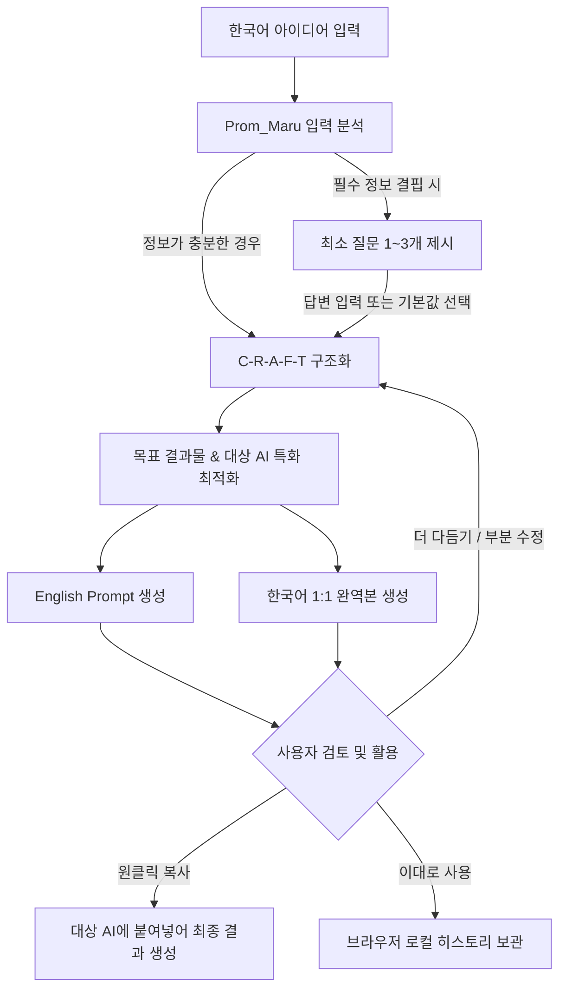

# Prom_Maru (프롬마루)

> **한국어 아이디어를 AI가 이해하기 좋은 영문 프롬프트로 만들어주는 Prompt Writing Assistant**  
> *Transform Korean ideas into high-performance English prompts for generative AI models.*

[](https://react.dev/)
[](https://www.typescriptlang.org/)
[](https://vitejs.dev/)
[](https://nodejs.org/)
[](https://expressjs.com/)
[](https://ai.google.dev/)
[](https://render.com/)

---

## 💡 프로젝트 소개

ChatGPT, Claude, Midjourney, Veo, Sora, Suno 등 최신 생성형 AI 모델들은 **맥락이 뚜렷하고 구체적인 영문 지시문**을 입력했을 때 의도에 가장 근접한 최고 품질의 결과를 만들어냅니다. 그러나 일상에서 영어로 복잡하고 체계적인 프롬프트를 매번 작성하기는 쉽지 않습니다.

**Prom_Maru(프롬마루)**는 사용자가 일상적인 한국어로 원하는 결과물을 자유롭게 설명하면:
1. 입력 의도를 분석하여 부족한 정보가 있을 때만 **1~3개의 최소한의 질문**으로 보완하고,
2. 프롬프트 핵심 아키텍처인 **C-R-A-F-T(Context, Role, Audience, Format, Task)** 구조로 정리하며,
3. 선택한 **8대 결과물 카테고리**와 **대상 AI(ChatGPT, Midjourney, Veo, Sora 등)**에 맞게 최적화된 **최종 영문 프롬프트(English Prompt)**를 생성합니다.
4. 사용자가 내용을 한눈에 검토하고 수정할 수 있도록 **누락 없는 전체 한국어 완역본**을 함께 제공합니다.

> ⚠️ **안내**: Prom_Maru는 이미지나 영상을 직접 렌더링하는 최종 생성기가 아닙니다. **다른 생성형 AI 엔진에 입력했을 때 원하는 결과물을 단번에 얻을 수 있도록 돕는 프롬프트 설계 도구(Prompt Writing Assistant)**입니다.

---

## 📸 Screenshots

> 저장소의 `docs/images/` 디렉터리에 스크린샷 이미지를 추가하면 아래 영역에 자동으로 표시됩니다.

### 🖥️ Desktop Showcase

*▲ Prom_Maru 데스크톱 작업 화면 (8대 카테고리 선택, C-R-A-F-T 5요소 분석, 영문/한국어 대조 뷰)*

<br>

<div align="center">
  <table border="0">
    <tr>
      <td align="center" width="50%">
        <strong>데스크톱 워크벤치</strong><br><br>
        
      </td>
      <td align="center" width="50%">
        <strong>모바일 반응형 뷰</strong><br><br>
        
      </td>
    </tr>
  </table>
</div>

---

## ✨ 핵심 기능

* **8개 목표 결과물 카테고리 & 세부 결과물 선택**
  * 문서, 이미지, 프레젠테이션, 비디오, 오디오, 코드, 데이터, 기타 등 세분화된 프리셋 지원
* **32개 스타터 추천 템플릿**
  * 8개 카테고리별 4개씩 엄선된 대표 실무 템플릿(총 32개)을 클릭 한 번으로 불러와 즉시 시작
* **대상 AI 엔진 맞춤 최적화**
  * 특정 도구에 종속되지 않는 `Auto` 범용 프롬프트부터 15종 이상의 특화 AI 선택 가능
* **영문 프롬프트(English Prompt) 우선 생성 & 한국어 완역본 제공**
  * 대상 AI에 그대로 붙여넣는 영문 본문과 사용자가 검토할 수 있는 한국어 번역본을 나란히 제공
* **결과 언어(Result Language) 지정**
  * 다른 AI가 산출할 최종 결과물의 언어를 '한국어' 또는 'English'로 지시하는 `Language Directive` 자동 포함
* **최소 질문(Minimum Questioning) 인터랙션**
  * 구체적인 주제가 주어지면 추가 질문 없이 즉시 프롬프트 초안(Draft)을 생성하며, 핵심 정보가 결핍된 경우에만 1~3개의 직관적인 선택지형 질문 제시
* **C-R-A-F-T 5요소 구조화 분석**
  * 완성된 프롬프트를 배경(Context), 역할(Role), 독자(Audience), 형식(Format), 과업(Task)으로 해체 분석
* **완성도 평가(Review Status) & 피드백**
  * `충분함(good)`, `보완하면 좋음(could_improve)`, `보완 필요(needs_improvement)` 3단계 평가 및 개선 조언
* **더 다듬기 (Refinement)**
  * AI가 추가 유도 질문을 제시하여 프롬프트의 디테일과 완성도를 한 단계 끌어올리는 기능
* **5요소 부분 수정 (Partial Edit)**
  * Context, Role, Audience, Format, Task 중 원하는 특정 요소만 지시문으로 즉시 재작성
* **AI 실행 시뮬레이션 (Simulation)**
  * 생성된 프롬프트를 Gemini 모델로 시험 실행하여 예상되는 결과물 텍스트를 미리 확인
* **원클릭 복사 & TXT 파일 내보내기**
  * 영문 프롬프트 원클릭 복사, 한국어 번역본 복사, 5요소 분석 내용이 정리된 TXT 다운로드
* **프라이빗 브라우저 로컬 히스토리**
  * `[ 이대로 사용 ]` 클릭 시 브라우저 `localStorage`에만 안전하게 보관 (중복 자동 방지, 검색 및 필터 지원)
* **BYOK (Bring Your Own Key) 보안 구조**
  * 개인 Google Gemini API Key를 직접 등록하여 사용하며, 서버 DB나 외부 저장소에 일체 영구 보관하지 않음

---

## 🧭 C-R-A-F-T Framework

Prom_Maru는 검증된 프롬프트 엔지니어링 구조인 **C-R-A-F-T 프레임워크**를 핵심 원칙으로 적용합니다.

| 요소 | 명칭 | 역할 및 설명 | 입력 원칙 |
|---|---|---|---|
| **C** | **Context** (배경 및 맥락) | 프로젝트의 상황, 배경, 사전 정보, 제약 조건 및 전제 사항 | ⭐ **핵심 요소** (사용자 입력) |
| **R** | **Role** (역할 및 전문성) | AI가 취해야 할 페르소나 또는 전문성 수준 | 💡 **자동 추론** (필요시 부여) |
| **A** | **Audience** (대상 및 독자) | 결과물을 소비할 최종 사용자, 독자, 고객의 지식수준과 관점 | 💡 **자동 추론** (맥락 기반 도출) |
| **F** | **Format** (형식 및 규격) | 문서 양식, 마크다운 구조, 화면비, 시각/음향 연출 지침 | ⚙️ **프리셋/추론** (매체별 반영) |
| **T** | **Task** (핵심 수행 과업) | 대상 AI가 구체적으로 단계별로 수행해야 할 명확한 작업 명령 | ⭐ **핵심 요소** (사용자 입력) |

> 📌 **설계 원칙**: 사용자가 5개 항목을 일일이 채워 넣을 필요가 없습니다. 사용자는 **Context(상황)**와 **Task(원하는 것)**만 자연스러운 한국어로 편하게 작성하면 되며, Role과 Audience는 Prom_Maru가 문맥에 맞추어 최적의 설정을 자동으로 추론합니다.

---

## 🔄 How It Works



### 3단계 사용자 흐름
1. **입력 (Input)**: 8개 카테고리 중 하나를 고르고, 대상 AI를 선택한 뒤 원하는 내용을 한국어로 편하게 입력합니다. (추천 템플릿 사용 가능)
2. **조율 (Refine / Q&A)**: 입력이 구체적이면 즉시 프롬프트 초안이 나오고, 아주 모호한 경우에만 AI가 짧은 선택지형 질문을 건넵니다.
3. **활용 (Output & Copy)**: 완성된 영문 프롬프트와 한국어 번역본을 확인하고, `[ 영문 프롬프트 복사 ]` 또는 `[ 이대로 사용 ]`을 눌러 ChatGPT, Claude, Midjourney 등에 바로 적용합니다.

---

## 📂 지원 결과물 카테고리 (Supported Result Types)

| 카테고리 | 대표 세부 결과물 | 주요 활용 예시 | 추천 대상 AI |
|---|---|---|---|
| **문서 / 텍스트** | 블로그 글, 사업계획서, 마케팅 카피, 기획서, 보고서, 뉴스레터, 보도자료, 시나리오 | B2B SaaS 소개 랜딩페이지 카피, IR 피치 요약 보고서 | ChatGPT, Claude, Gemini |
| **이미지 / 디자인** | 실사 제품 사진, 미니멀 로고, 디지털 일러스트, 3D 캐릭터 콘셉트, UI 목업, 패키지 | 스튜디오 조명 세라믹 컵 제품 샷, 사이버펑크 네온 골목길 | Midjourney, ChatGPT (DALL-E), Gemini |
| **프레젠테이션** | 스타트업 피치덱 (10-12장), 제안서 슬라이드, 사내 교육 워크숍 교안, IR 설명회 | 시리즈 A 투자 유치용 10슬라이드 핵심 메시지 구조화 | ChatGPT, Claude, Gemini |
| **비디오 / 영상** | 유튜브 쇼츠/릴스 (15~30초), 시네마틱 트레일러, 제품 광고, 3D 모션 영상 | 밤거리 질주하는 스포츠카 드론 트래킹 샷 (시네마틱 4K) | Veo, Sora, Google Flow, Higgsfield, Runway, Kling |
| **오디오 / 음성** | 내레이션 보이스, 팟캐스트 대화, 시네마틱 BGM, 로파이 칠 비트, 게임 SFX | 다큐멘터리 40대 남성 차분한 톤 내레이션, 명상 앰비언트 음원 | ElevenLabs, Suno, Udio |
| **코드 / 개발** | React UI 컴포넌트, Express REST API, SQL 쿼리 최적화, Python 스크립트 | TypeScript 칸반 보드 컴포넌트, JWT 인증 미들웨어 | GitHub Copilot, ChatGPT, Claude, Gemini |
| **데이터 / 분석** | A/B 테스트 가설 검증, KPI 대시보드 지표 설계, 코호트 리텐션 진단 | 결제 페이지 이탈률 개선 통계 검정, SaaS LTV/CAC 리포트 | ChatGPT, Claude, Gemini |
| **기타 / 커스텀** | 브랜드 네이밍, 1:1 심층 인터뷰 질문지, 업무 자동화 워크플로, 사용자 정의 | 생성형 AI 도입 임원진 인터뷰 질문지, 스타트업 네이밍 20선 | Auto, ChatGPT, Claude, Gemini |

---

## 🎯 대상 AI 최적화 (Target AI Optimization)

Prom_Maru는 지원 여부가 검증되지 않은 가상의 전용 파라미터나 비공개 명령어(플래그)를 임의로 지어내지 않습니다. **실제 모델이 가장 잘 반응하는 자연어 묘사 방식, 정보 구조화 순서, 매체별 핵심 강조 요소**를 바탕으로 최적화합니다.

### 1. `Auto` (범용 모드)
* 특정 플랫폼의 독점 문법에 의존하지 않습니다.
* 선명한 맥락, 명확한 역할 정의, 논리적인 단계별 과업, 표준 자연어 서술로 구성되어 **어떤 생성형 AI에 입력해도 높은 호환성**을 보장합니다.

### 2. 특정 AI별 최적화 특성
* **ChatGPT / Claude / Gemini**: 명확한 마크다운 계층 구조, 페르소나 및 역할 분담, 입출력 제약 조건 및 단계별 추론(Step-by-step) 유도.
* **Midjourney**: 피사체의 재질, 조명(Lighting), 렌즈 특성, 색감(Color palette), 구도 및 예술적 화풍을 상세 자연어 구문으로 묘사.
* **Google Veo / OpenAI Sora**: 연속적인 시공간 흐름, 카메라 워크(Dolly, Pan, Tracking shot), 물리 법칙 준수, 조명 및 장면 전환의 자연어 서술.
* **Google Flow / Higgsfield / Runway / Kling**: 인물 및 사물의 동역학(Kinetics), 숏 구성, 화면 연출 에너지와 씬(Scene) 전환 지침.
* **ElevenLabs**: 발화자의 음색(Timbre), 호흡, 감정 상태, 발화 템포 및 톤앤매너 텍스트 지침.
* **Suno / Udio**: 음악 장르, 악기 편성, 템포(BPM), 무드 및 가사 섹션([Verse], [Chorus]) 메타 태그 구조화.
* **GitHub Copilot**: 명확한 언어 버전, 프레임워크 제약, 타입 안정성(TypeScript), 에러 핸들링 및 클린 코드 아키텍처 경계 명시.

---

## 🌐 결과 언어 (Result Language) 설정의 이해

* **프롬프트 본문 언어**: 대상 AI가 가장 높은 이해력을 발휘할 수 있도록 **영문(English)**으로 작성됩니다.
* **한국어 완역본**: 사용자가 영문 프롬프트의 모든 세부 조항을 온전히 이해하고 검토할 수 있도록 **한국어(Korean)** 번역본이 항상 함께 생성됩니다.
* **UI의 `결과 언어` 필드**: 프롬프트 자체의 언어를 의미하는 것이 아니라, **해당 프롬프트를 다른 AI에 넣었을 때 최종적으로 산출되어야 하는 산출물의 언어**를 뜻합니다.
  * 예: `결과 언어 = 한국어`를 선택하면, 완성된 영문 프롬프트 하단에 아래와 같은 명시적 지시어가 포함됩니다.
    ```text
    Language Directive: The final generated output/content must be written entirely in natural, professional Korean.
    ```

---

## 🎨 UI / UX 디자인 철학

* **Warm Ivory Palette**: 눈이 편안한 미색 웜 아이보리 (`#FAF8F5`) 배경으로 장시간 프롬프트 작업 시 피로도 최소화.
* **Violet Primary & Soft Coral Accent**: 핵심 액션은 신뢰감 있는 바이올렛 (`#7C3AED`), 추천 템플릿과 보조 강조는 부드러운 코랄 핑크 (`#FB7185`) 배색.
* **Warm Charcoal Typography**: 본문 텍스트에 강한 순수 검정 대신 부드러운 다크 웜 그레이 (`#1F2937`)와 한국어 최적화 Pretendard 서체 적용.
* **Fully Responsive**: 데스크톱 2컬럼 레이아웃부터 모바일 헤더 햄버거 메뉴, 카드형 워크벤치까지 모든 뷰포트 완벽 대응.
* **Zero Pill Discipline & Card Workbench**: 단순한 둥근 알약형 UI를 지양하고 넉넉한 여백과 명확한 계층의 카드형 워크벤치 인터페이스 제공.

---

## 🏗️ 시스템 아키텍처 (Architecture)

```text
┌────────────────────────────────────────────────────────┐
│                   User Browser Client                  │
│  - React 19 + TypeScript + Vite SPA                   │
│  - Tailwind CSS v4 + Pretendard                        │
│  - State Management & Browser localStorage             │
└───────────────────────────┬────────────────────────────┘
                            │ HTTP / JSON API Proxy
                            │ (Header: x-gemini-api-key)
┌───────────────────────────▼────────────────────────────┐
│              Node.js Express Server (server.ts)        │
│  - Production Static File Serving (dist/)              │
│  - Gemini API Proxy & Connection Test                  │
│  - Prom_Maru System Instructions Enforcement           │
│  - Strict JSON Response Parsing & Auto-Retry           │
│  - Friendly Quota (429) & Auth Error Handling          │
└───────────────────────────┬────────────────────────────┘
                            │ HTTPS (@google/genai SDK)
┌───────────────────────────▼────────────────────────────┐
│                    Google Gemini API                   │
│  - Models: gemini-3.8-flash / gemini-flash-latest      │
└────────────────────────────────────────────────────────┘
```

### `server.ts`의 주요 역할
1. **Gemini API Proxy (`/api/prom-maru/generate`)**: 클라이언트가 전달한 BYOK API Key를 안전하게 전달받아 `@google/genai` SDK를 통해 Gemini 모델 호출.
2. **System Instruction 집행**: 프롬프트 아키텍트 원칙, C-R-A-F-T 5요소 분석, 결과 언어 지침, 대상 AI 맞춤 최적화 프롬프트를 일관되게 주입.
3. **JSON 파싱 및 자동 복구 (Resilience)**: AI 응답의 마크다운 코드 블록이나 텍스트를 감지하고 2차 시도까지 자동 재시도하여 순수 JSON 데이터 보장.
4. **연결 테스트 (`/api/gemini/test-connection`)**: 사용자가 입력한 API Key의 유효성을 실시간 경량 호출(ping)로 즉시 확인.
5. **프롬프트 시뮬레이션 (`/api/prom-maru/simulate`)**: 완성된 프롬프트를 테스트해 볼 수 있는 실행 엔드포인트 제공.
6. **Production 정적 서빙**: `npm run build` 결과물인 `dist/` 정적 파일을 서빙하며, `/api/*` 경로를 제외한 모든 라우트를 SPA fallback(`index.html`)으로 라우팅.

---

## 🔒 BYOK (Bring Your Own Key) & 프라이버시

Prom_Maru는 사용자의 프라이버시와 투명한 데이터 관리를 최우선으로 설계되었습니다.

* **회원가입 및 사용자 계정 없음**: 별도의 로그인이나 개인정보 입력 없이 즉시 사용 가능합니다.
* **서버 데이터베이스(DB) 없음**: 서버에 사용자 데이터베이스가 존재하지 않으며, 프롬프트 내용이나 히스토리가 서버에 저장되지 않습니다.
* **API Key 영구 보관 금지**: 사용자가 입력한 Google Gemini API Key는 서버 환경변수나 파일에 저장되지 않으며, 오직 사용자의 브라우저 `localStorage`에만 저장됩니다.
* **요청별 일회성 프록시 전달**: API Key는 API 호출 시 HTTP 요청 헤더(`x-gemini-api-key`)에 실려 서버 프록시를 통해 Gemini로 전달된 후 즉시 소멸합니다.
* **서버 로그 출력 차단**: 보안을 위해 사용자의 API Key나 프롬프트 전문은 서버 콘솔 및 에러 로그에 일절 출력되지 않습니다.
* **언제든지 삭제 가능**: 상단 [설정] 모달에서 등록된 API Key를 클릭 한 번으로 브라우저에서 영구 삭제할 수 있습니다.

> ℹ️ **보안 안내**: Prom_Maru는 브라우저 표준 `localStorage`를 사용합니다. 암호화 기능을 허위로 기재하지 않으며, 공용 PC 사용 시 사용 후 [설정]에서 API Key 삭제 및 히스토리 전체 비우기를 권장합니다.

---

## 🚀 Development Journey (주요 이슈 및 해결)

Prom_Maru를 풀스택 프로덕션 웹 애플리케이션으로 고도화하고 Render에 배포하는 과정에서 해결한 대표적인 기술 이슈들입니다.

| Problem (발생 문제) | Root Cause (원인 분석) | Solution (해결 방법) |
|---|---|---|
| **정적 호스팅(GitHub Pages) 배포 시 API 작동 불가** | Gemini 호출 프록시와 시스템 지침을 처리하는 Express 백엔드 런타임이 정적 호스팅 환경에 존재하지 않음 | 백엔드와 프론트엔드가 일체형으로 실행되는 **Render Web Service** 풀스택 아키텍처로 배포 방식 확정 |
| **Render 배포 중 Node.js 설치 실패 (Exit status 127)** | `package.json`의 `engines.node`가 `>=20.0.0`으로 너무 넓게 열려 있어 빌드 머신이 불안정한 Node 26을 선택 | `engines.node`를 안정적인 LTS 계열인 `"20.x"`로 엄격하게 고정하여 빌드 환경 통일 |
| **`server.ts` 프로덕션 실행 방식** | 프로덕션 환경에서 TypeScript 인터프리터(`tsx`) 직접 실행 시 메모리 및 시동 안정성 저하 | `esbuild`를 빌드 파이프라인에 추가하여 `server.ts`를 단일 경량 번들 `server.js`로 컴파일 후 `node server.js`로 실행 |
| **새로고침 시 히스토리 데이터 유실** | 컴포넌트 마운트 시 가드 없이 실행된 `useEffect([history])`가 초기 빈 배열 `[]`로 `localStorage`를 덮어쓰는 레이스 컨디션 발생 | `loadHistoryFromStorage`로 상태 초기화 동기화, `isInitialMount` 가드 도입, `[이대로 사용]` 클릭 시 `localStorage` 즉시 동기 저장 구현 |
| **동일 프롬프트 중복 저장** | 기존 저장 여부 검사 부재로 `[이대로 사용]` 다회 클릭 시 동일한 영문 프롬프트가 히스토리에 누적 | `promptEn.trim()` 기반 중복 방지 검사를 추가하여 동일 프롬프트 재저장 차단 |
| **클립보드 API 권한 예외로 인한 저장 중단** | 비보안 컨텍스트나 포커스가 해제된 브라우저 환경에서 `navigator.clipboard.writeText` 예외 발생 시 후속 저장 함수가 호출되지 않음 | 클립보드 복사 로직에 `try-catch` 안전 래퍼를 적용하여 클립보드 오류와 무관하게 히스토리 저장이 100% 보장되도록 수정 |
| **Gemini 429 Quota 에러 노출** | API 사용량 한도 초과 시 원시 API 에러 문자열이 그대로 UI에 노출되어 사용자 혼란 유발 | 서버 에러 핸들러에서 Quota/Rate limit 코드를 포착하여 친절한 안내 메시지로 치환하고 다중 모델 폴백 적용 |

---

## 🛠️ 기술 스택 (Tech Stack)

### Frontend
* **Core**: React 19, TypeScript 5.x
* **Build Tool**: Vite 6.x
* **Styling**: Tailwind CSS v4, Lucide React (Icons), Pretendard Font

### Backend
* **Runtime**: Node.js 20.x
* **Server Framework**: Express 4.21
* **Bundler**: esbuild 0.28 (TypeScript 서버 컴파일)
* **Dev Runner**: tsx (개발 서버 핫 리로드 지원)

### AI & API
* **SDK**: `@google/genai` v2.4
* **AI Models**: Google Gemini (`gemini-3.8-flash`, `gemini-flash-latest`, `gemini-3.1-flash-lite`)

### Storage & Security
* **Client Storage**: Browser `localStorage` (API Key & Prompt History)
* **Architecture**: BYOK (Bring Your Own Key), Zero Server Database

### Deployment
* **Platform**: Render Web Service
* **Repository**: GitHub

---

## 📁 프로젝트 구조 (Project Structure)

```text
prom-maru/
├── docs/                             # 프로젝트 문서 및 이미지 에셋
│   └── images/                       # UI 스크린샷 및 시연 자료
│       ├── prom-maru-overview.png    # 메인 오버뷰 스크린샷
│       ├── prom-maru-desktop.png     # 데스크톱 화면 스크린샷
│       ├── prom-maru-mobile.png      # 모바일 반응형 스크린샷
│       └── presentation/             # 프로젝트 발표 슬라이드 (slide-01 ~ 16)
│           └── slide-01.png
├── public/                           # 정적 웹 파비콘 및 에셋
├── src/                              # 프론트엔드 React 소스코드
│   ├── components/                   # 재사용 가능한 UI 컴포넌트
│   │   ├── Header.tsx                # 상단 헤더, 템플릿/가이드/히스토리/설정 버튼
│   │   ├── PromptForm.tsx            # 카테고리, AI, 결과물 유형, 주제 입력 폼
│   │   ├── DraftResultView.tsx       # 완성된 영문/한국어 프롬프트, 5요소 분석, 액션 버튼
│   │   ├── QuestionView.tsx          # 결측 정보 보완을 위한 1~3개 최소 질문 뷰
│   │   ├── ElementsBreakdown.tsx     # C-R-A-F-T 5대 요소 시각화 및 카드 뷰
│   │   ├── FrameworkGuideModal.tsx   # C-R-A-F-T 프레임워크 학습 모달
│   │   ├── HistoryDrawer.tsx         # 저장된 프롬프트 히스토리 슬라이드 드로어
│   │   ├── PartialEditModal.tsx      # 5요소 개별 부분 수정 모달
│   │   ├── RefineModal.tsx           # 프롬프트 추가 다듬기 모달
│   │   ├── SimulationModal.tsx       # Gemini 가상 실행 시뮬레이션 모달
│   │   ├── SettingsModal.tsx         # BYOK Gemini API Key 관리 및 연결 테스트 모달
│   │   ├── TemplatesModal.tsx        # 8대 카테고리 32개 추천 템플릿 모달
│   │   └── HeroIllustration.tsx     # 상단 히어로 일러스트레이션 벡터 그래픽
│   ├── constants/                    # 프리셋 및 템플릿 데이터
│   │   ├── presets.ts                # 8대 카테고리, 대상 AI 16종, C-R-A-F-T 정의
│   │   └── templates.ts              # 32개 카테고리별 실무 추천 템플릿 데이터
│   ├── types/                        # TypeScript 타입 인터페이스
│   │   └── prompt.ts                 # 프롬프트, 히스토리, 응답 데이터 규격
│   ├── App.tsx                       # 최상위 애플리케이션 상태 및 흐름 제어
│   ├── main.tsx                      # React DOM 엔트리 포인트
│   └── index.css                     # Tailwind CSS v4 글로벌 스타일
├── index.html                        # HTML5 엔트리 템플릿 (SEO 및 OpenGraph 메타)
├── metadata.json                     # AI Studio 앱렛 메타데이터
├── package.json                      # 의존성, 스크립트, engines(node: 20.x) 정의
├── server.ts                         # Express 백엔드 프록시 & 프로덕션 서빙 소스
├── server.js                         # esbuild로 컴파일된 프로덕션 실행 파일 (빌드 시 생성)
├── tsconfig.json                     # TypeScript 컴파일러 설정
└── vite.config.ts                    # Vite 빌드 및 개발 환경 설정
```

---

## 💻 로컬 설치 및 실행 방법 (Installation)

### 사전 요구 사항
* **Node.js**: `20.x` (LTS 버전 권장)
* **npm**: `10.x` 이상

### 1. 저장소 클론 (Clone)
```bash
git clone https://github.com/your-username/prom-maru.git
cd prom-maru
```

### 2. 의존성 패키지 설치
```bash
npm install
```

### 3. 개발 서버 실행 (Development)
```bash
npm run dev
```
* 브라우저에서 `http://localhost:3000`으로 접속합니다.
* `tsx server.ts`가 구동되며 Vite 개발 미들웨어를 통해 실시간 핫 리로딩(HMR)을 지원합니다.

---

## 📦 프로덕션 빌드 (Production Build)

프로덕션 배포 시에는 TypeScript 서버를 직접 실행하지 않고, 최적화 번들링된 프론트엔드 정적 파일과 esbuild로 컴파일된 Node.js 서버 파일을 실행합니다.

```bash
# 1. 프론트엔드 Vite 번들링 (dist/) + server.ts esbuild 컴파일 (server.js)
npm run build

# 2. 프로덕션 Node.js 서버 실행 (PORT 환경변수 자동 감지)
npm start
```

* `npm run build`: `dist/index.html`, `dist/assets/*` 생성 및 `server.js` 단일 파일 생성.
* `npm start`: 순수 Node.js 런타임으로 `node server.js` 구동.

---

## ☁️ 배포 가이드 (Deployment)

Prom_Maru는 **Full-Stack (React SPA + Express API Proxy)** 구조이므로, 정적 호스팅(GitHub Pages 등)에서는 Express 서버를 실행할 수 없습니다. 따라서 Node.js 런타임을 온전히 지원하는 **Render Web Service** 배포를 표준으로 사용합니다.

```text
Google AI Studio
       ↓ Git Push
GitHub Repository
       ↓ Webhook Auto Deploy
Render Web Service
       ↓ npm install && npm run build -> npm start
Prom_Maru Production Live
```

### Render Web Service 설정 값

| 항목 | 설정 값 | 설명 |
|---|---|---|
| **Environment** | `Node` | Node.js 실행 환경 |
| **Node Version** | `20.x` | `package.json`의 `engines` 규격 준수 |
| **Build Command** | `npm install && npm run build` | 의존성 설치 및 프론트/서버 전체 빌드 |
| **Start Command** | `npm start` | `node server.js` 실행 |
| **Auto Deploy** | `Yes` | `main` 브랜치 푸시 시 자동 배포 |

> 💡 **PORT 환경변수**: Render는 컨테이너 시작 시 동적으로 `PORT` 환경변수를 주입합니다. Prom_Maru의 `server.ts`는 `process.env.PORT || 3000`을 사용하므로 별도의 포트 설정 없이 즉시 바인딩됩니다.

---

## 📊 Project Presentation

Prom_Maru 프로젝트의 기획 배경, 문제 정의, C-R-A-F-T 아키텍처 및 구현 성과를 정리한 발표 자료입니다.  
슬라이드 원본 이미지는 `docs/images/presentation/` 디렉터리에 보관되어 있습니다.

<div align="center">
  
  <p><em>▲ Prom_Maru 프로젝트 발표자료 표지 (Slide 01)</em></p>
</div>

<br>

<details>
<summary><strong>👉 전체 발표 슬라이드 펼쳐보기 (Slide 01 ~ 16)</strong></summary>
<br>

<div align="center">
  <p><strong>Slide 01: 프로젝트 표지 및 개요</strong></p>
  
  <hr>

  <p><strong>Slide 02: 문제 정의 - 한국어 사용자의 생성형 AI 프롬프트 작성 애로사항</strong></p>
  
  <hr>

  <p><strong>Slide 03: 해결책 - 프롬마루(Prom_Maru)의 탄생 배경</strong></p>
  
  <hr>

  <p><strong>Slide 04: C-R-A-F-T 프레임워크 설계 원칙</strong></p>
  
  <hr>

  <p><strong>Slide 05: 8대 카테고리 및 세부 결과물 지원 현황</strong></p>
  
  <hr>

  <p><strong>Slide 06: 대상 AI별 맞춤 최적화 전략 (Auto, LLM, Image, Video, Audio)</strong></p>
  
  <hr>

  <p><strong>Slide 07: 사용자 중심 인터랙션 - 최소 질문(Minimum Questioning) 기법</strong></p>
  
  <hr>

  <p><strong>Slide 08: 프롬프트 품질 리뷰 및 완성도 평가 시스템</strong></p>
  
  <hr>

  <p><strong>Slide 09: 더 다듬기(Refine) & 5요소 부분 수정(Partial Edit) 기능</strong></p>
  
  <hr>

  <p><strong>Slide 10: 32개 스타터 추천 템플릿 라이브러리</strong></p>
  
  <hr>

  <p><strong>Slide 11: BYOK (Bring Your Own Key) 보안 및 개인정보 보호 설계</strong></p>
  
  <hr>

  <p><strong>Slide 12: 브라우저 로컬 히스토리 동기화 및 지속성 아키텍처</strong></p>
  
  <hr>

  <p><strong>Slide 13: Full-Stack 시스템 구조 (React 19 + Express + Gemini API)</strong></p>
  
  <hr>

  <p><strong>Slide 14: Render 프로덕션 배포 파이프라인 (esbuild + Node 20.x)</strong></p>
  
  <hr>

  <p><strong>Slide 15: 개발 여정 및 주요 트러블슈팅 사례</strong></p>
  
  <hr>

  <p><strong>Slide 16: 결론 및 향후 발전 로드맵</strong></p>
  
</div>

</details>

---

## 📄 라이선스 (License)

This project is licensed under the Apache License 2.0.  
자세한 내용은 [LICENSE](LICENSE) 파일을 참조하세요.

---

<div align="center">
  <strong>Prom_Maru (프롬마루)</strong> • 한국어 사용자를 위한 AI 프롬프트 아키텍트<br>
  Context • Role • Audience • Format • Task
</div>
